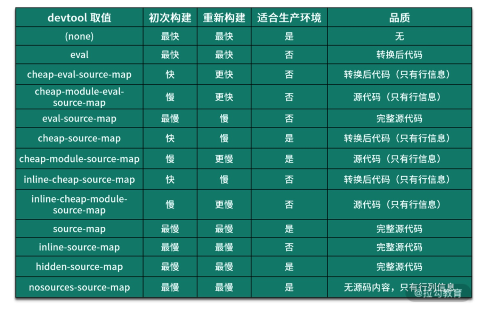

#### 第01讲：Webpack 究竟解决了什么问题？

解决了如何在前端吸纳灌木丛中更高效的管理和维护项目中的每一个资源。

模块化演进的过程：

1. 文件划分方式

   - 模块直接在全局工作，大量的模块成员污染全局作用域
   - 没有私有空间，所有模块内的成员都可以在模块外部被访问或者修改
   - 一旦模块增多，容易产生明明冲突
   - 无法管理模块与模块之间的依赖关系
   - 在维护的过程中也很难分辨每一个成员所属的模块

2. 命名空间方式

   ​	虽然解决了明明冲突，但其他问题依旧存在

   ```js
   // module-a.js
   window.moduleA = {
     method1: function () {
       console.log('moduleA#method1')
     }
   }
   // module-b.js
   window.moduleB = {
     data: 'something'
     method1: function () {
       console.log('moduleB#method1')
     }
   }
   <script src="module-a.js"></script>
     <script src="module-b.js"></script>
     <script>
       moduleA.method1()
       moduleB.method1()
       // 模块成员依然可以被修改
       moduleA.data = 'foo'
     </script>
   ```

3. IIFE依赖参数

   可以使用立即执行函数的参数作为依赖声明属性，这是得每一个模块之间的依赖关系变得更加明显

   ```js
   // module-a.js
   ;(function ($) { // 通过参数明显表明这个模块的依赖
     var name = 'module-a'
   
     function method1 () {
       console.log(name + '#method1')
       $('body').animate({ margin: '200px' })
     }
   
     window.moduleA = {
       method1: method1
     }
   })(jQuery)
   ```

   以上几种方式只是解决了模块代码的组织问题，但是模块加载的问题并没有解决

   > node.js的模块加载机制是commonJS，而commonJS约定是以同步的方式加载模块，因为nodejs执行机制是在启动的时候加载模式，执行过程只是使用模块
   >
   > 如果在浏览器端也使用同步的加载模式，就会引起大量的同步模式请求，导致应用运行效率低下

   模块打包工具的出现可以更好的帮助我们解决复杂应用开发过程中的代码组织问题

   模块化思想的缺点：

   - 使用esm模块系统本身，并不是所有的浏览器都支持
   - 模块化划分的文件过多，而前端又是运行在浏览器中，每一个文件都需要单独从服务器中请求回来，零散的模块文件必然会导致浏览器的频繁发送网络请求，影响应用的使用
   - 前端开发不只有js，还有css，html这些也需要模块化

4. wenpack的作用

   1. 它需要具备编译代码的能力，通过 Loader 机制对其实现编译转换
   2. 能够将散落的模块再打包到一起
   3. 它需要支持不同种类的前端模块类型


#### 第02讲：如何使用 Webpack 实现模块化打包？

⚠️：webpack是webpack的核心模块，webpack-cli是wenbpack的cli程序，用来在命令行中调用webpack

安装完成之后，webpack-cli所提供的cli程序就会出现在node_module/.bin目录中

webpack的工作模式：

- production：启动内置优化插件，自动优化打包结果，打包速度偏慢
- development：自动优化打包速度，添加一些调试过程中的辅助插件
- none：运行最原始的打包，不做任何额外的处理

commonJs与esm的区别：

- commonJs输出的是值得拷贝，esm输出的是值的引用
- commonJs是运行时加载，esm时编译时输出接口
- commonJs的模块require是同步加载，esm的import是异步加载，有一个独立的模块依赖的解析阶段

```js
/**
 *  @type {import('webpack').Configuration} 
 **/
```

#### 第03讲：如何通过loader实现特殊资源加载

> loader是webpack实现不同类型资源模块加载的核心，从而实现整体项目的模块化
>
> 只在模块的加载环节工作

所有的资源一般都是通过js代码去加载其他资源，这是因为webpack在打包过程中会循环遍历每个模块，然后根据配置将每个遇到的模块交给对应的loader去处理，最后将处理完的结果打包到一起。


每个webpack的loader都需要导出一个函数，这个函数就是我们这个loader对资源的处理过程，它的输入就是加载的资源文件内容，输出就是我们加工后的结果

webpack加载资源文件的过程类似于一个工作管道，在整个过程中可以使用多个loader，但是最终这个管道结束过后必须是一段标准的js代码字符串

#### 第04讲：如何利用插件机制横向扩展webpack的构建能力

> webpack插件机制的目的是为了增强webpack在项目中自动化构建方面的能力
>
> 触及webpack工作的每一个环节，webpack的插件机制就是我们在软件开发过程中最常见的钩子机制
>
> webpack的插件必须是一个函数或者是一个包含apply方法的对象，一般我们都会定一个类型，在这个类型中定义apply方法。

- 实现自动在打包之前清除dist目录
- 自动生成应用所需要的html文件
- 根据不同环境为代码注入类似api地址这种可能变化的部分
- 拷贝不需要参与打包的资源文件到输出目录
- 压缩webpack打包完成后输出的文件
- 自动发布打包结果到服务器实现自动部署


#### 第05讲：探索webpack运行机制与核心工作原理

> 通过loader处理特殊类型资源的加载，例如加载样式，图片
>
> 通过plugin实现各种自动化的构建任务，例如自动压缩，自动发布

webpack核心工作过程中的关键环节：

- webpack cli启动打包流程
- 载入webpack核心模块，创建compiler对象
- 使用compiler对象开始编译整个项目
- 从入口文件开始，解析模块依赖，形成依赖关系树
- 递归依赖树，将每个模块交给对应的loader处理
- 合并loader处理完的结果，将打包结果输出到dist目录

#### 第06讲：如何使用Dev Server提高你的本地开发效率

自动编译，无须每次修改完代码之后手动编译，提高开发效率

#### 第07讲：如何配置webpack sourcemap的最佳实践

sourceMap可以有效的解决现代化前端应用的调试问题，主要就是做到源代码和转换之后代码的映射



```
eval：可以在编译之后的代码中指出错误行列信息，eval就是js中的一个函数，可以通过指定sourceUrl来添加这段代码所属的文件路径
eval-source-map：可以通过sourceMap反推出源码中的错误行列信息
cheap-eval-source-map：这种模式只能定位到行信息，源码是经过es6转换过后的
cheap-module-eval-source-map：这种模式和上面类似，源码不会经过转化
source-map：可以推出源码中的错误行信息
```

开发环境使用：cheap-module-eval-source-map

生产环境使用：none

```js
const AllDevtoolModes = [
    'eval',
    'cheap-eval-source-map',
    'cheap-module-eval-source-map',
    'eval-source-map',
    'cheap-source-map',
    'cheap-module-source-map',
    'inline-cheap-source-map',
    'inline-cheap-module-source-map',
    'source-map',
    'inline-source-map',
    'hidden-source-map',
    'nosources-source-map',
]

const config = AllDevtoolModes.map(i => ({
    devtool: i,
    mode: 'none',
    entry: './src/index.js',
    output: {
        filename: `js/${i}.js`
    },
    module: {
        rules: [
            {
                test: /\.css$/,
                use: ['style-loader', 'css-loader'],
            },
            {
                test: /\.md$/,
                use: './loaders/markdown-loader',
            },
            {
                test: /\.js$/,
                use: {
                    loader: 'babel-loader',
                    options: {
                        presets: ['@babel/preset-env']
                    }
                }
            }
        ]
    },
    plugins: [
        new CleanWebpackPlugin(),
        new HtmlWebpackPlugin({
            filename: `${i}.html`
        })
    ]
}))
```


#### 第08讲：如何让你的模块支持热替换机制？

webpack-dev-server开启hot之后，css样式修改生效，但是js没有生效，这是因为，

css模块的热更新替换是在style-loader中实现的，

js模块的导出是没有任何规律的，导出的js模块有可能是一个字符串，有可能是一个函数，也有可能是一个对象，所以说无法直接实现一个可以通用多有情况的模块替换方法

#### 第09讲：玩转 Webpack 高级特性应对项目优化需求（上）

- Tree Shaking：会将未引用的代码移除掉
  - usedExports-打包结果中之导出外部用到的成员
  - minimize-压缩打包结果
  - concatenateModules：尽可能合并每一个模块到一个函数中

> Tree Shaking实现的前提是ES Modules，也就是说，最终交给webpack打包的代码，必须是使用ES Modules的方式来组织的模块化

- sideEffects：通过配置标示我们的代码是否有副作用，从而提供更大的压缩空间，一般是在开发npm包时使用

> Tree Shaking只能移除没有用到的代码，并不能移除没有用到的模块，而如果想要移除整个模块，需要开启sideEffects属性
>
> sideEffects：
>
> 重点就是想明白那些副作用代码是可以随着模块的移除而移除
>
> ⚠️对全局有影响的副作用代码不能移除，而只是对模块由影响的副作用代码就可以移除

#### 第10讲：玩转 Webpack 高级特性应对项目优化需求（下）

> all in one的弊端：
>
> - 如果应用非常复杂，模块非常多，那么就会导致打包的体积非常大
>
> http1.1的缺陷：
>
> - 同一个域名下面并行请求是有限制的
> - 每个请求本身都会有一定的延迟
> - 每次请求除了传输内容，还有额外的请求头，大量的请求的情况下，这些请求头加在一起也会浪费流量和带宽

- code splitting
  - 根据业务不同配置多个打包入口，输出多个打包结果
  - 结合esm的动态倒入特性，按需加载模块

#### 第11讲：如何优化 Webpack 的构建速度和打包结果？

- 为不同环境创建不同的配置

  - 在配置文件中添加相应的判断条件，根据环境导出不同配置

  ```js
  module.exports = (env, argv) => {
      const config = {
          mode: env
      };
      if (env === 'development') {
          config.devtool = 'cheap-eval-module-source-map'
      }else if(env === 'production'){
          config.devtool = 'none'
      }
      return config;
  }
  ```

  - 为不同环境单独添加一个配置文件，一个环境对应一个配置文件


#### 如何为webpack编译阶段提速
> speed-measure-webpack-plugin  分析打包的速度
> webpack-bundle-analyzer 分析包的体积
- 减少执行编译的模块
    - ignorePlugin
    - 模块按需引入
    - module 
- 提升单个模块的构建速度
    - 减少模块的查找路径设置include exclude resolve
    - noparse
    - 合理设置source map
- 并行打包构建
    - HappyPack && thread-loader
    - parallel-webpackl-webpack

#### webpack打包阶段提速
- 以提升当前任务工作效率为目标的方案
    例如js使用TerserWebpackPlugin作为压缩插件
    - cache
    - cssMinimizerWebpackPlugin 支持多进程
- 以提升后续环节工作效率为目标的方案
    - split chunks


#### webpack缓存优化
- 编译阶段的缓存
    - 例如babel-loader，开启缓存cacheDirectory，cacheIdentifier，cacheCompression（默认为true，压缩代码，减小缓存目录的体积）
    - Cache-loader
        ```
        ./webpack.cache.config.js
        ...
        module: {
        rules: [
            {
            test: /\.js$/,
            use: ['cache-loader', 'babel-loader'],
            },
        ],
        }
        ...
        ```
- 优化打包阶段的缓存
    - 生成 ChunkAsset 时的缓存优化
    
